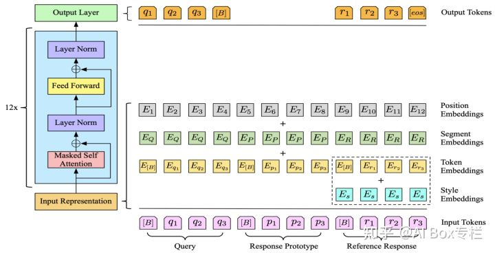
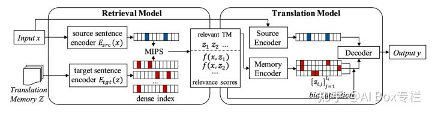

- [[reading]]
	- [[@举一反三：示例增强的（example augmented）自然语言处理]] #data_augment
		- [[brief_abstact]]
			- 这是一篇综述, 讲了比较流行的几种方法, 不同方法也有不同idea的论文贡献.
			- collapsed:: true
			  1. 将示例中的答案modify一下, 模型对检索出的示例对文本内容进行参考.
				- **Prototype-to-Style: Dialogue Generation with Style-Aware Editing on Retrieval Memory**
					- 将答案的和style相关的词mask掉, 获得一个prototype
					- embedding有四种, token + position + segment(区分Query, Response Prototype, Reference Response), 在Reference Response  还带了一个Style Embedding.
					- 
				- **Neural Machine Translation with Monolingual Translation Memory**
					- 
					- 论文上看到主要是将Translation Memory作为检测输入相似的source sentence的检索库.
						- 方法: FAISS - Facebook AI Similarity Search
					- 在**Translation Model**上对检索示例进行继续attention score的相加.
					-
			- 2.
			-
			-
		- [[ideas]]
		- [[opinion]]
		- TODO  Finish Reading
		- TODO Finish Reviewing
		-
	-