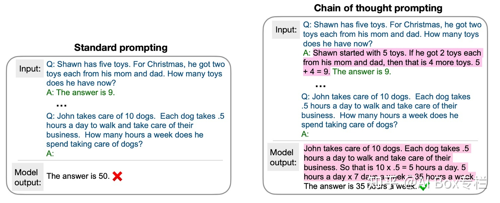

- [[paper]]
	- [[举一反三：示例增强的（example augmented）自然语言处理]] #data_augment #QA
		- [[brief_abstact]]
			- 这是一篇综述, 讲了比较流行的几种方法, 不同方法也有不同idea的论文贡献.
			- 1. 将示例中的答案modify一下, 模型对检索出的示例对文本内容进行参考.
				- *Prototype-to-Style: Dialogue Generation with Style-Aware Editing on Retrieval Memory*
					- 将答案的和style相关的词mask掉, 获得一个prototype
					- embedding有四种, token + position + segment(区分Query, Response Prototype, Reference Response), 在Reference Response  还带了一个Style Embedding.
					- file-path:: file://D:\NutStore\PAPER_HOME/Augmentation/Training Data is More Valuable than You Think - A Simple and Effective Method by_2022_Wang_Xu_Fang_Liu_Sun_Xu_Zhu_Zeng_.pdf
					  file:: [Training Data is More Valuable than You Think - A Simple and Effective Method by_2022_Wang_Xu_Fang_Liu_Sun_Xu_Zhu_Zeng_.pdf](file://D:\NutStore\PAPER_HOME/Augmentation/Training Data is More Valuable than You Think - A Simple and Effective Method by_2022_Wang_Xu_Fang_Liu_Sun_Xu_Zhu_Zeng_.pdf)
					  title:: hls__Training Data is More Valuable than You Think - A Simple and Effective Method by_2022_Wang_Xu_Fang_Liu_Sun_Xu_Zhu_Zeng_
				- *Neural Machine Translation with Monolingual Translation Memory*
					- 
					- 论文上看到主要是将Translation Memory作为检测输入相似的source sentence的检索库.
						- 方法: FAISS - Facebook AI Similarity Search
					- 在*Translation Model*上对检索示例进行继续attention score的相加.
			- _Chain of Thought Prompting Elicits Reasoning in Large Language Models_ #prompt
				- 用example来引导QA的回答, 让模型模仿解题过程, 使结果更具有可解释性.
				- 
				- 一种改进: 生成多个解释和答案并选取第一个预估解释为正确的答案作为最终预测.
		- [[ideas]]
			- prompt可以更复杂一些? 还要注意前后顺序对性能的影响(太玄了算了吧) #prompt
		- [[opinion]]
		- DONE  Finish Reading
		- DONE Finish Reviewing
		- TODO  Need Intensive Reading
-
-