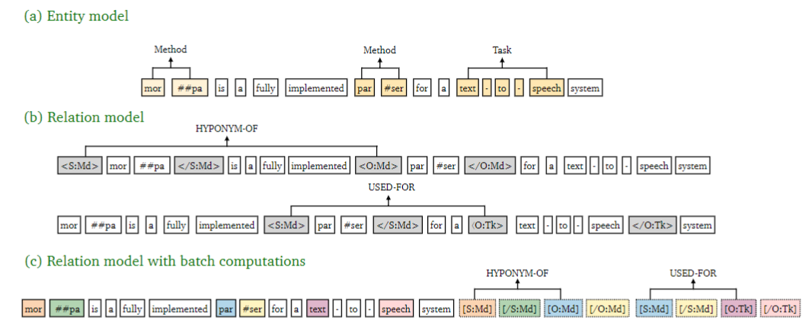

institution:: arXiv
tags:: [[Computer Science - Computation and Language]]
date:: [[Tue, 2021/03/23]]
title:: A Frustratingly Easy Approach for Entity and Relation Extraction
item-type:: [[report]]
access-date:: 2022-06-07T07:27:07Z
original-title:: A Frustratingly Easy Approach for Entity and Relation Extraction
url:: http://arxiv.org/abs/2010.12812
authors:: [[Zexuan Zhong]], [[Danqi Chen]]
library-catalog:: arXiv.org
links:: [Local library](zotero://select/library/items/TT9SV4YC), [Web library](https://www.zotero.org/users/9034808/items/TT9SV4YC)
report-number:: arXiv:2010.12812

- [[Abstract]]
	- End-to-end relation extraction aims to identify named entities and extract relations between them. Most recent work models these two subtasks jointly, either by casting them in one structured prediction framework, or performing multi-task learning through shared representations. In this work, we present a simple pipelined approach for entity and relation extraction, and establish the new state-of-the-art on standard benchmarks (ACE04, ACE05 and SciERC), obtaining a 1.7%-2.8% absolute improvement in relation F1 over previous joint models with the same pre-trained encoders. Our approach essentially builds on two independent encoders and merely uses the entity model to construct the input for the relation model. Through a series of careful examinations, we validate the importance of learning distinct contextual representations for entities and relations, fusing entity information early in the relation model, and incorporating global context. Finally, we also present an efficient approximation to our approach which requires only one pass of both entity and relation encoders at inference time, achieving an 8-16$\times$ speedup with a slight reduction in accuracy.
- [[Attachments]]
	- [arXiv.org Snapshot](https://arxiv.org/abs/2010.12812) {{zotero-imported-file YNURNEJR, "2010.html"}}
	- [A Frustratingly Easy Approach for Entity and Relation Extraction_2021_Zhong_Chen_.pdf](zotero://select/library/items/SNUNMMCD) {{zotero-linked-file "attachments:ACL/A Frustratingly Easy Approach for Entity and Relation Extraction_2021_Zhong_Chen_.pdf"}}
- [[paper_note]]
	- 
	- ((629eff27-11c2-476b-a421-9e568e105a05))
	- 在之后我组会分享的一个论文里, 文章把这三种方式分别定义为:
		- Token-concat
			- 直接使用Token的向量拼接进行表示
		- Solid marker
			- 在句子中间插入固定位置的Marker, 用self-attention后的marker的向量表示
		- Levitated Marker
			- 在句子之后一大串marker, marker和原句的之间共享position embedding, 用这样隐式的一种方法进行token之间关系的连接(有效性有待商榷)
	- NER模型: BERT后接一个span分类网络, 基于片段排列, 提取所有可能片段排列, 通过softmax
-