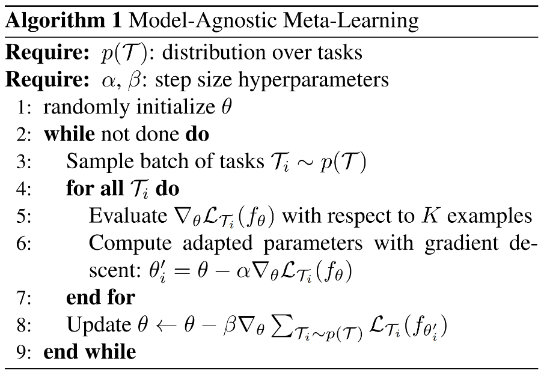

links:: [Local library](zotero://select/library/items/M8ZKKCEF), [Web library](https://www.zotero.org/users/9034808/items/M8ZKKCEF)
authors:: [[Chelsea Finn]], [[Pieter Abbeel]], [[Sergey Levine]]
tags:: [[Computer Science - Artificial Intelligence]], [[Computer Science - Computer Vision and Pattern Recognition]], [[Computer Science - Machine Learning]], [[Computer Science - Neural and Evolutionary Computing]]
date:: [[Tue, 2017/07/18]]
item-type:: [[preprint]]
title:: Model-Agnostic Meta-Learning for Fast Adaptation of Deep Networks

- [[Abstract]]
	- We propose an algorithm for meta-learning that is model-agnostic, in the sense that it is compatible with any model trained with gradient descent and applicable to a variety of different learning problems, including classification, regression, and reinforcement learning. The goal of meta-learning is to train a model on a variety of learning tasks, such that it can solve new learning tasks using only a small number of training samples. In our approach, the parameters of the model are explicitly trained such that a small number of gradient steps with a small amount of training data from a new task will produce good generalization performance on that task. In effect, our method trains the model to be easy to fine-tune. We demonstrate that this approach leads to state-of-the-art performance on two few-shot image classification benchmarks, produces good results on few-shot regression, and accelerates fine-tuning for policy gradient reinforcement learning with neural network policies.
- [[Attachments]]
	- [arXiv.org Snapshot](https://arxiv.org/abs/1703.03400) {{zotero-imported-file I6NBPFKR, "1703.html"}}
	- [Model-Agnostic Meta-Learning for Fast Adaptation of Deep Networks_2017_Finn_Abbeel_Levine_.pdf](zotero://select/library/items/DRUX3TTX) {{zotero-linked-file "attachments:Few-shot/Model-Agnostic Meta-Learning for Fast Adaptation of Deep Networks_2017_Finn_Abbeel_Levine_.pdf"}}
- [[note]]
	- gradient by gradient, 两个梯度优化
		- 第一个梯度
	- 
		- 步骤3
		- 步骤5 的loss是对N-way K-shot 中的N*K 个Support set进行 梯度下降
		- 对于一个batch里的每一条task, 都有一个对应的$f_{\theta_i'}(\cdot)$, 用这个分类器在这个task的query set的结果, 对$\theta$本身进行求导更新(即完成第8步的更新)
	- fine-tune的步骤:
		- 和上面类似, 因为是同一类的任务, 所以不用很多种task
		- 不需要第一步的随机初始化 而是直接使用$M_{meta}$的结果(训练了直接用嘛)
		-
		-