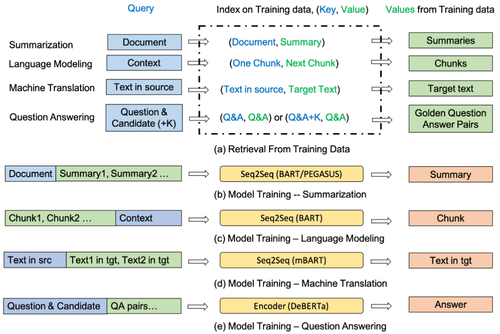

title:: Training Data is More Valuable than You Think: A Simple and Effective Method by Retrieving from Training Data

- report-number:: arXiv:2203.08773
  links:: [Local library](zotero://select/library/items/ZAHJTNMD), [Web library](https://www.zotero.org/users/9034808/items/ZAHJTNMD)
  library-catalog:: arXiv.org
  authors:: Shuohang Wang, Yichong Xu, Yuwei Fang, Yang Liu, Siqi Sun, Ruochen Xu, Chenguang Zhu, Michael Zeng
  short-title:: Training Data is More Valuable than You Think
  url:: http://arxiv.org/abs/2203.08773
  original-title:: Training Data is More Valuable than You Think: A Simple and Effective Method by Retrieving from Training Data
  access-date:: 2022-06-02T12:08:10Z
  item-type:: [[report]]
  title:: Training Data is More Valuable than You Think: A Simple and Effective Method by Retrieving from Training Data
  date:: [[Mar 16th, 2022]]
  tags:: Computer Science - Artificial Intelligence, Computer Science - Computation and Language, Computer Science - Information Retrieval
  institution:: arXiv
- [[Abstract]]
	- Retrieval-based methods have been shown to be effective in NLP tasks via introducing external knowledge. However, the indexing and retrieving of large-scale corpora bring considerable computational cost. Surprisingly, we found that REtrieving from the traINing datA (REINA) only can lead to significant gains on multiple NLG and NLU tasks. We retrieve the labeled training instances most similar to the input text and then concatenate them with the input to feed into the model to generate the output. Experimental results show that this simple method can achieve significantly better performance on a variety of NLU and NLG tasks, including summarization, machine translation, language modeling, and question answering tasks. For instance, our proposed method achieved state-of-the-art results on XSum, BigPatent, and CommonsenseQA. Our code is released, https://github.com/microsoft/REINA .
- [[Attachments]]
	- [Training Data is More Valuable than You Think - A Simple and Effective Method by_2022_Wang_Xu_Fang_Liu_Sun_Xu_Zhu_Zeng_.pdf](zotero://select/library/items/37VYLPUF) {{zotero-linked-file "attachments:Augmentation/Training Data is More Valuable than You Think - A Simple and Effective Method by_2022_Wang_Xu_Fang_Liu_Sun_Xu_Zhu_Zeng_.pdf"}}
- [[paper_note]]
	- 
		- ((6298e309-6550-4ace-b50d-afeafe9bcd74))
		- 之前的做法:类似于数据增强, 在大规模语料库中将输入信息『扩充』一下, 而不会把『训练数据』扯上
		- 类似于: 同一类数学题, 给了一个题目, 再给三个没有答案的类似的题目
		- 现在微软做法: 把课上讲的例题堆在一起喂进去)
		- 而且之前是在『题库』里搜, 现在直接在『例题库』搜索, 会快很多
		- 模型输入从之前的 $M(x)$ 变成了 $M(f(x, (k_1, v_1), ..., (k_i,v_i), ... ))$
		- 使用 **BM25** 算法寻找和 $x$ 最相近的 $k$ 个句子
	- 
		- ((6299cf90-2937-4762-8641-ff1ecbc75941))
		- 其实整个模型(Retrieval from Training Data)根据不同的任务, 规定了不同的$k-v$关系
			- ((6299f28d-1572-468b-a16e-e5f698fb054e))摘要生成: k是文章,  v是生成的索引, 用k搜相似, 但因为文章太长了就不拼上去了, 只拼v部分;
			- ((6299f293-a4fc-41f3-b6e1-c5a2f8fbf5f0))语言模型: 完成的是段落的『下一段预测』任务, 前一段是后一段的key, 后一段是value
			- ((6299f29e-abb6-4395-90ff-a1ef494a71b1))机器翻译: 原句是k, 翻译结果是v, 同样只把译文拼上去
			- ((6299f2b7-8089-4be8-911c-430b42f8743d))问答: 首先明确任务, 任务是选择题类的
				- 这类问题的$(k-v)$是"问句-正确回答"
	- 训练相关: 在训练的时候使用**BM25**可能会导致检测到原来输入, 所以要对这一条进行过滤!
		- 类似于: 要让model自己学习例题, 就不要把答案给他, 例题当真题做
	- test阶段(or预测阶段) 的时候就不用了(毕竟evaluation set里的东西也不会在training set里出现)