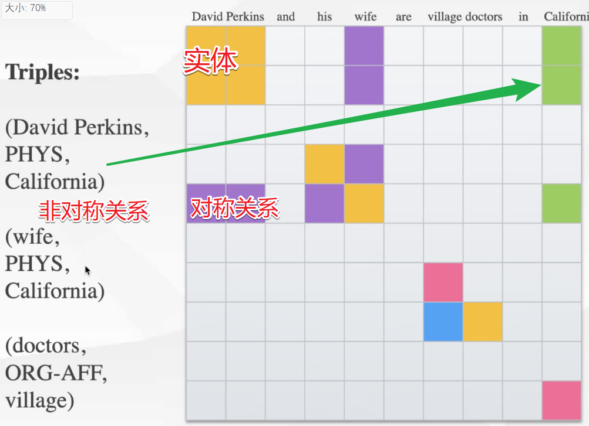

links:: [Local library](zotero://select/library/items/WGZWJBZV), [Web library](https://www.zotero.org/users/9034808/items/WGZWJBZV)
library-catalog:: ACLWeb
authors:: Yijun Wang, Changzhi Sun, Yuanbin Wu, Hao Zhou, Lei Li, Junchi Yan
short-title:: UniRE
url:: https://aclanthology.org/2021.acl-long.19
original-title:: UniRE: A Unified Label Space for Entity Relation Extraction
access-date:: 2022-06-08T02:43:59Z
item-type:: [[conferencePaper]]
pages:: 220–231
title:: UniRE: A Unified Label Space for Entity Relation Extraction
doi:: 10.18653/v1/2021.acl-long.19
proceedings-title:: Proceedings of the 59th Annual Meeting of the Association for Computational Linguistics and the 11th International Joint Conference on Natural Language Processing (Volume 1: Long Papers)
conference-name:: ACL-IJCNLP 2021
place:: Online
publisher:: Association for Computational Linguistics
date:: 2021

- [[Abstract]]
	- Many joint entity relation extraction models setup two separated label spaces for the two sub-tasks (i.e., entity detection and relation classification). We argue that this setting may hinder the information interaction between entities and relations. In this work, we propose to eliminate the different treatment on the two sub-tasks' label spaces. The input of our model is a table containing all word pairs from a sentence. Entities and relations are represented by squares and rectangles in the table. We apply a unified classifier to predict each cell's label, which unifies the learning of two sub-tasks. For testing, an effective (yet fast) approximate decoder is proposed for finding squares and rectangles from tables. Experiments on three benchmarks (ACE04, ACE05, SciERC) show that, using only half the number of parameters, our model achieves competitive accuracy with the best extractor, and is faster.
- [[Attachments]]
	- [UniRE - A Unified Label Space for Entity Relation Extraction_2021_Wang_Sun_Wu_Zhou_Li_Yan_.pdf](zotero://select/library/items/GA79YW48) {{zotero-linked-file "attachments:ACL/UniRE - A Unified Label Space for Entity Relation Extraction_2021_Wang_Sun_Wu_Zhou_Li_Yan_.pdf"}}
- [[note]]
	- ((62a93013-7fc6-4350-9a08-0a10e8ec2dd6))统一是什么意思?
		- 和陈丹琦的那个pipeline的模型相比:
			- pipeline一定是两个模型 , 陈丹琦用的是枚举实体对的方式
			- relation的话是两两实体做一个, 进行判断
			- 总结: NER和RE是完全分立的, separate label space deserve separate encoders
		- 因此: Joint encoder deserve joint encoder
		- 传统: NER ->  Relation Classification
		- 本文: 把NER当做RC. , 使用table的方式
		- 标注方式:
			- 对token做一个n*n的表格
			- 对角线标实体
			- 对称性的关系, 在对称关系
			- 非对称, 定义一下
			- 
		- 论文的三个loss
			- 实体loss
			- 对称关系loss: 对称的位置应该差距尽可能小
			- implication loss: 如果有relation, 那么应该有实体存在
				- 在没有实体的那个上面, 两列上的最有可能的关系应该是0
		- 解码:
			- 也是先用span进行划分, 再看实体, 再看关系