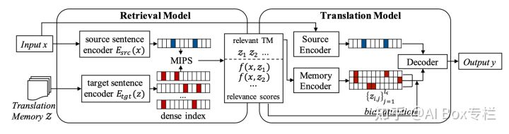
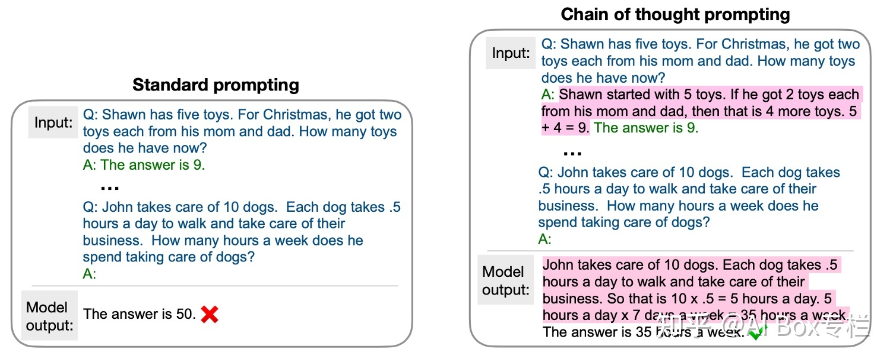

tags:: [[example augmented]]
title:: 举一反三：示例增强的（example augmented）自然语言处理
website-title:: 知乎专栏
item-type:: [[webpage]]
access-date:: 2022-06-01T07:26:12Z
original-title:: 举一反三：示例增强的（example augmented）自然语言处理
language:: zh
url:: https://zhuanlan.zhihu.com/p/512969250
links:: [Local library](zotero://select/library/items/RJ4VY48V), [Web library](https://www.zotero.org/users/9034808/items/RJ4VY48V)

- [[Abstract]]
	- 作者：龚政，中国人民大学硕士二年级在读，研究方向为自然语言处理。 引言：近年来随着预训练技术的发展，通过在海量的文本语料上进行预训练，模型已经在大多数自然语言处理任务上取得了卓越的性能。但是目前看来…
- [[Attachments]]
	- [Snapshot](https://zhuanlan.zhihu.com/p/512969250) {{zotero-imported-file 46FSJTBP, "512969250.html"}}
-
- 这是一篇综述, 讲了比较流行的几种方法, 不同方法也有不同idea的论文贡献.
- 1. 将示例中的答案modify一下, 模型对检索出的示例对文本内容进行参考.
	- *Prototype-to-Style: Dialogue Generation with Style-Aware Editing on Retrieval Memory*
		- 将答案的和style相关的词mask掉, 获得一个prototype
		- embedding有四种, token + position + segment(区分Query, Response Prototype, Reference Response), 在Reference Response  还带了一个Style Embedding.
		-
	- *Neural Machine Translation with Monolingual Translation Memory*
		- 
		- 论文上看到主要是将Translation Memory作为检测输入相似的source sentence的检索库.
			- 方法: FAISS - Facebook AI Similarity Search
		- 在*Translation Model*上对检索示例进行继续attention score的相加.
	- *Chain of Thought Prompting Elicits Reasoning in Large Language Models* #prompt
		- 用example来引导QA的回答, 让模型模仿解题过程, 使结果更具有可解释性.
		- 
		- 一种改进: 生成多个解释和答案并选取第一个预估解释为正确的答案作为最终预测.